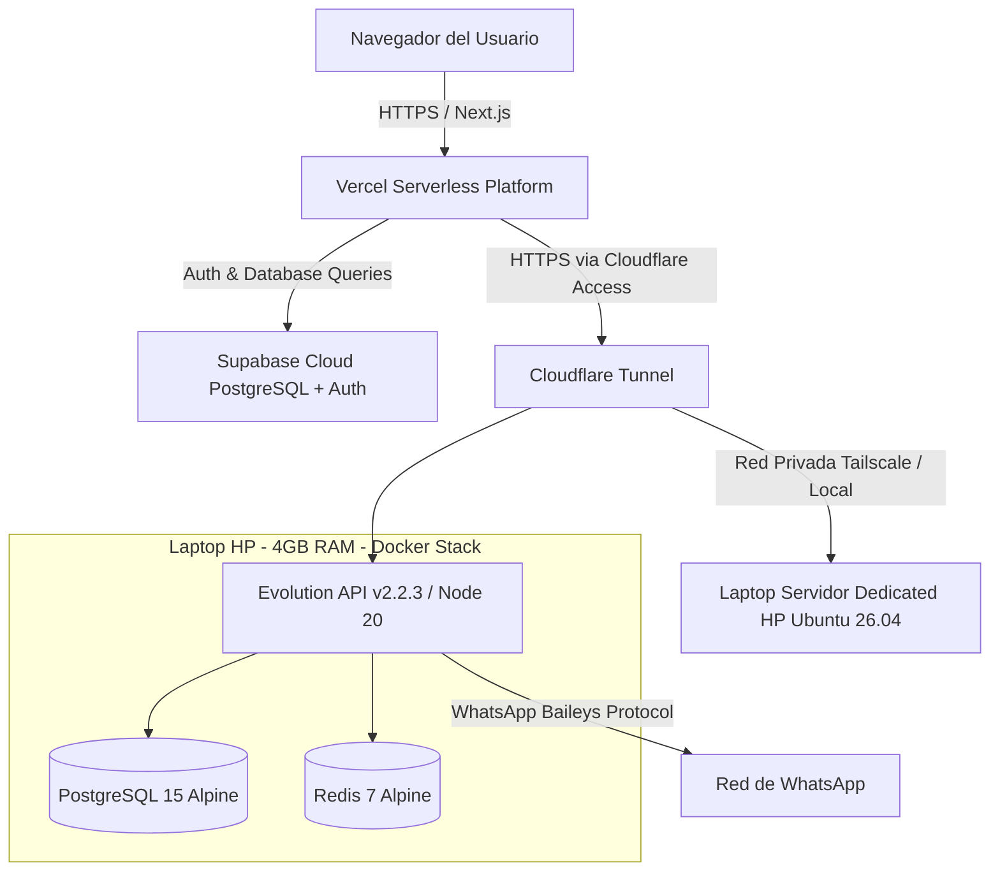
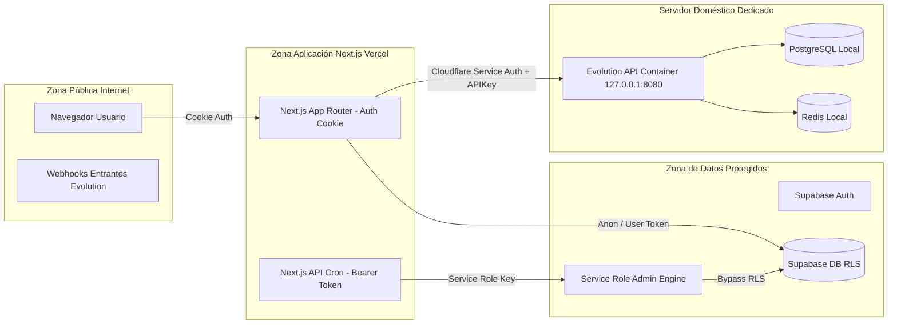

# Mapa de Arquitectura Actual

## 1. Diagrama de Despliegue Actual

---

## 2. Diagrama de Zonas de Confianza

---

## 3. Propiedad de Datos por Componente

* **Supabase Cloud**: Propietario de `companies`, `profiles`, `crm_marketing_contacts`, `crm_wa_campaigns`, `crm_wa_queue`, `spa_visits`, `spa_payments`, `spa_services`, `spa_staff`.
* **Evolution API (PostgreSQL Local)**: Propietario del estado interno de las sesiones Baileys, claves criptográficas de WhatsApp, tokens de sesión de dispositivo y caché Redis.
