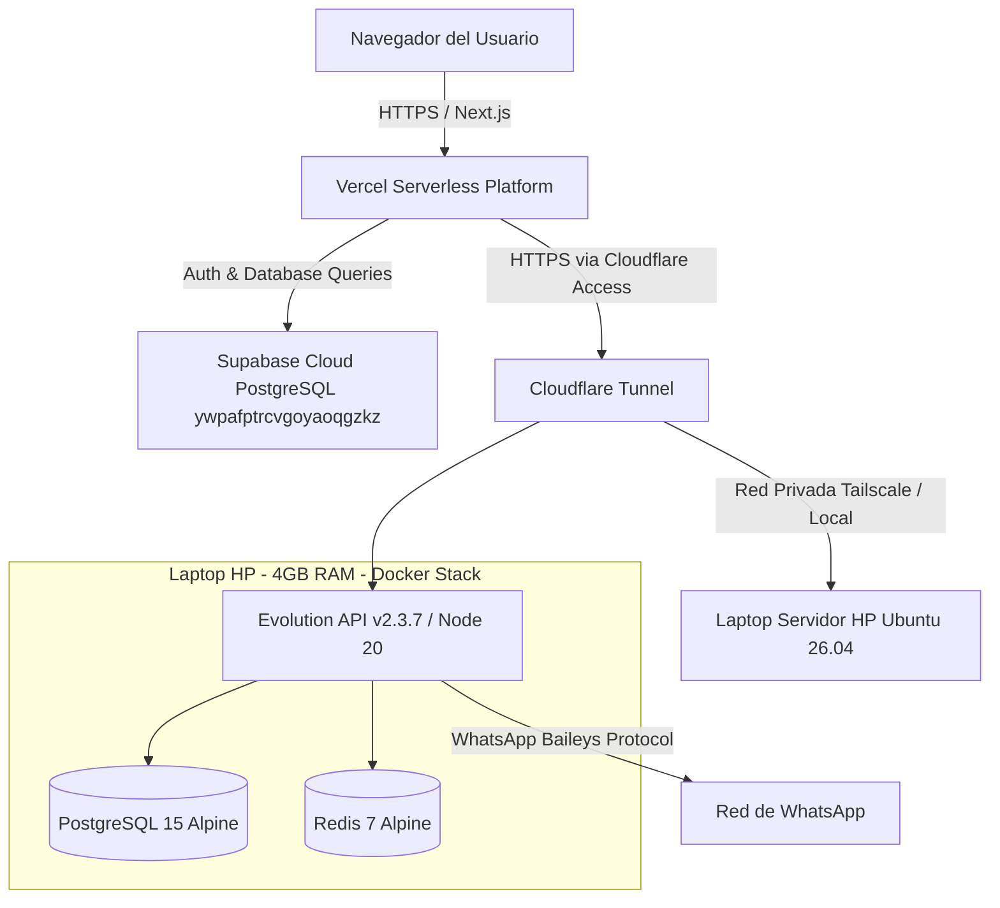

# Mapa de Arquitectura Actual (Etiquetado con Nivel de Verificación)

## 1. Diagrama de Despliegue Actual

---

## 2. Clasificación de Verificación de Arquitectura

- **VERIFICADO**:
  - Supabase Cloud (`Project ref: ywpafptrcvgoyaoqgzkz`) gestiona 16 tablas públicas (`spa_products`, `spa_visits`, etc.) y 1,120 contactos reales.
  - El servidor doméstico `servidor-julio` ejecuta Docker Compose con `evolution-api:v2.3.7`, `postgres:15-alpine` y `redis:7-alpine` de manera saludable (`healthy`).
  - La red Tailscale (`100.72.75.79`) y Docker están activos (`active`).

- **INFERIDO**:
  - Cloudflare Tunnel gestiona las cabeceras `CF-Access-Client-Id` y `CF-Access-Client-Secret` enviadas desde `evolution/client.ts`. El servicio `cloudflared` aparece como `activating` en el servidor y parece reintentar la conexión de tunelado.

- **NO VERIFICADO**:
  - No se ha ejecutado una simulación de fallo de red de Vercel durante el envío activo de un chunk de la cola masiva para medir el comportamiento de reconexión.
