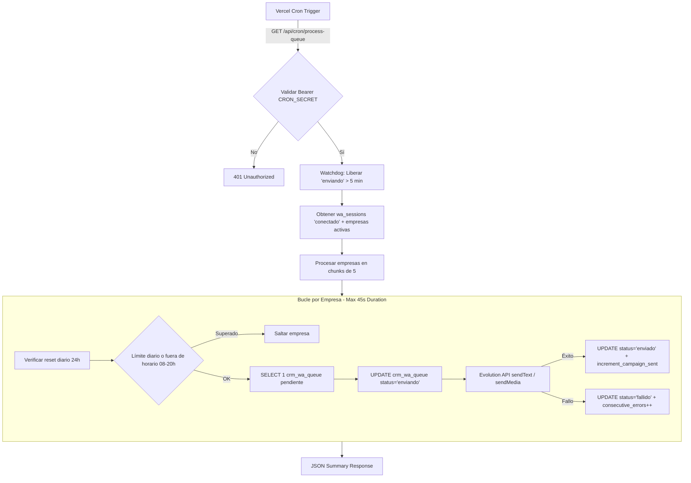

# Flujos Críticos y Sistema de Colas

## 1. Diagrama de Flujo del Cron de Envíos (`/api/cron/process-queue`)

---

## 2. Análisis del Sistema de Colas

* **Frecuencia**: Ejecución cada minuto mediante Vercel Cron.
* **Límite de Tiempo (Timeout)**: La Serverless Function en Vercel posee un límite máximo de ejecución (45-60s). Si la función es cancelada mientras espera el delay entre mensajes, se interrumpe la iteración.
* **Recuperación de Errores (Watchdog)**: Los mensajes trabados en `enviando` por más de 5 minutos son re-marcados automáticamente a `pendiente`.
* **Riesgo de Duplicidad**: Reducido mediante reclamación atómica `UPDATE status='enviando' WHERE status='pendiente'`. No obstante, si Evolution recibe y procesa el mensaje pero la red hacia Supabase cae antes de responder el HTTP, la transacción local puede reintentarse.
