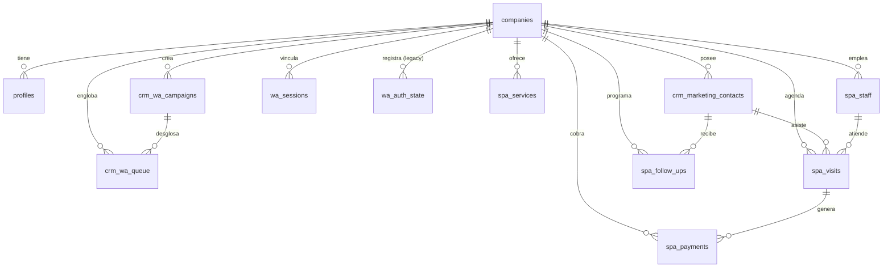

# Inventario del Esquema de Supabase

Este documento describe la estructura relacional y los componentes del esquema público de Supabase extraídos de las 34 migraciones SQL registradas.

---

## 1. Diagrama Entidad-Relación (ERD)

---

## 2. Inventario de Tablas Públicas (15 Tablas)

1. `companies`: Almacena información de tenants, estado administrativo (`activa`, `suspendida`, `cancelada`), tipo de plan y fechas de suscripción.
2. `profiles`: Perfiles de usuario vinculados a `auth.users` mediante el campo `id`, asociándolos a una empresa mediante `company_id`.
3. `crm_marketing_contacts`: Contactos del CRM por tenant, con campos de teléfono, nombres y DNI.
4. `crm_wa_campaigns`: Campañas masivas de WhatsApp, con métricas de envíos, fallos y respuestas.
5. `crm_wa_queue`: Cola de mensajes individuales a enviar, con estados (`pendiente`, `enviando`, `enviado`, `fallido`).
6. `wa_sessions`: Estado de la sesión de WhatsApp del tenant (`conectado`, `esperando_qr`, `generando_qr`, `desconectado`), guardando el `bb_project_id` como `instanceName`.
7. `wa_auth_state`: Tabla legacy de persistencia de credenciales Baileys (actualmente sin uso activo).
8. `spa_services`: Catálogo de servicios de belleza/spa por tenant.
9. `spa_staff`: Personal/trabajadores del salón por tenant.
10. `spa_staff_services`: Tabla intermedia de asociación entre trabajadores y servicios.
11. `spa_staff_schedules`: Horarios semanales de trabajo del personal.
12. `spa_staff_blocks`: Bloqueos u horas no disponibles del personal.
13. `spa_visits`: Citas/visitas agendadas por clientes en el salón.
14. `spa_payments`: Registro de pagos y deudas asociados a las visitas.
15. `spa_follow_ups`: Seguimientos y recordatorios post-atención.

---

## 3. Investigaciones de Campos Legacy

* **`wa_sessions.bb_project_id`**: Campo originado en BuilderBot que actualmente almacena el `instanceName` inmutable en Evolution API (ej. `company_6f20d8ab...`). Debe ser renombrado mediante migración segura en etapas futuras a `external_instance_name`.
* **`wa_sessions.bb_host`**: Campo remanente de BuilderBot Cloud sin uso en Evolution API.
* **`wa_auth_state`**: Tabla creada para almacenar credenciales multi-file de Baileys nativo. Inactiva al gestionar las sesiones internamente Evolution API.

---

## 4. Archivos de Evidencia Generados

Los siguientes archivos CSV detallados se encuentran disponibles en `docs/refactor/01-baseline/evidence/supabase/`:
- `tables.csv`, `columns.csv`, `constraints.csv`, `foreign-keys.csv`, `indexes.csv`, `functions.csv`, `triggers.csv`, `views.csv`, `rls-policies.csv`, `grants.csv`, `storage-buckets.csv`, `extensions.csv`, `row-counts.csv`.
